# Tugas Praktikum Pemrograman Mobile 4

1. Nama : Panky Bintang Pradana Yosua
2. NIM : H1D022077
3. Shift Baru : F

## Snapshot Aplikasi

### 1. Registrasi dan Login

### 2. List, Tambah, dan Detail

### 3. Ubah, Hapus, dan Drawer

# Tugas Praktikum Pemrograman Mobile 5

1. Nama : Panky Bintang Pradana Yosua
2. NIM : H1D022077
3. Shift Baru : F

## Penjelasan Kode

### 1. Registrasi

#### 1.1 Halaman Registrasi

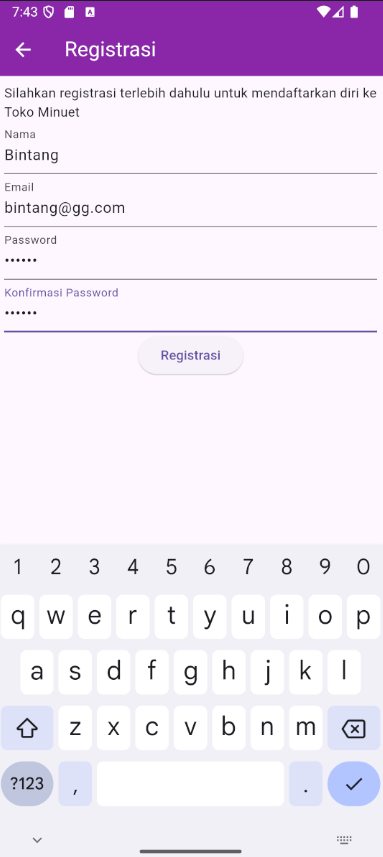

#### 1.2 Registrasi Sukses

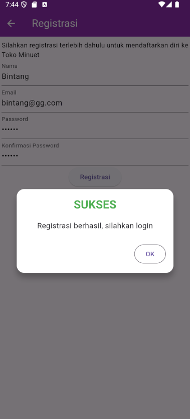

### 2. Login

#### 2.1 Halaman Login

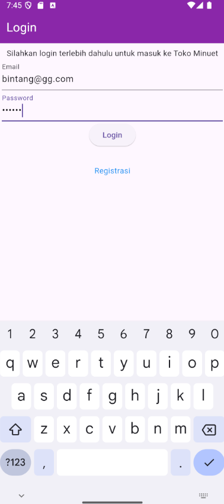

#### 2.2 Login Gagal

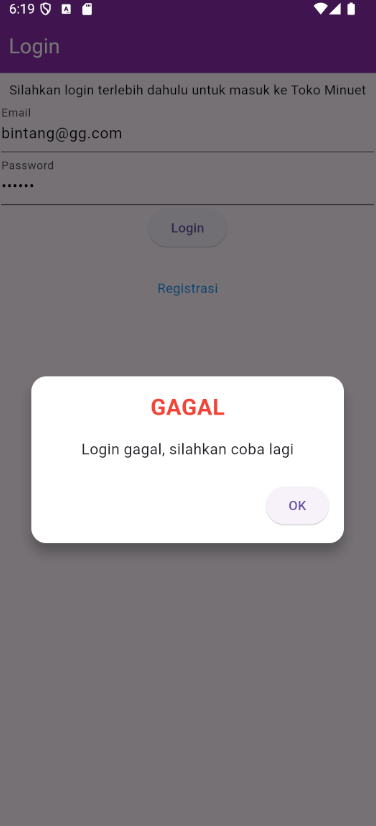

### 3. List Produk

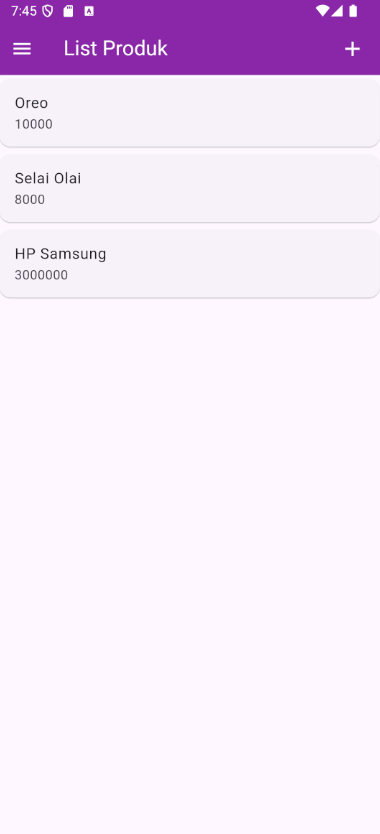

### 4. Tambah Produk

#### 4.1 Tambah Produk

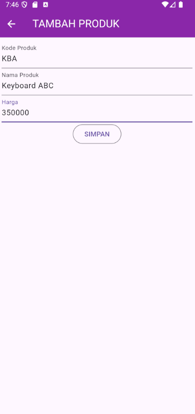

#### 4.2 Tambah Produk Sukses

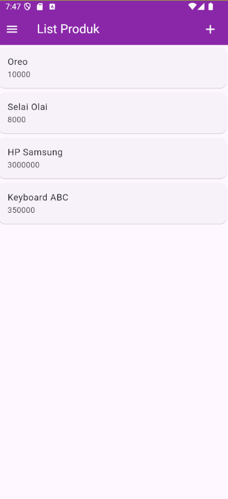

### 5. Detail Produk

#### 5.1 Halaman Detail Produk

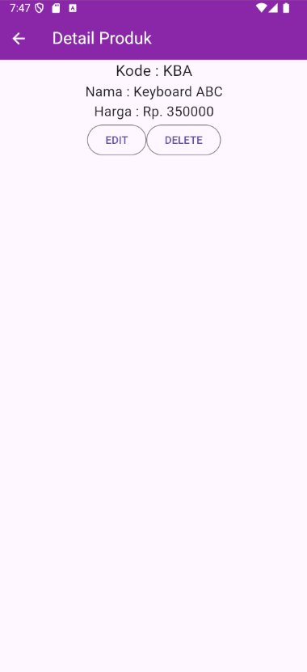

#### 5.2 Halaman Edit Produk

    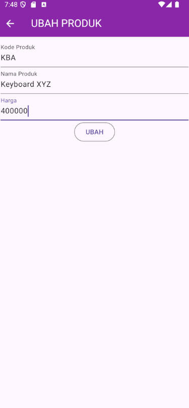
    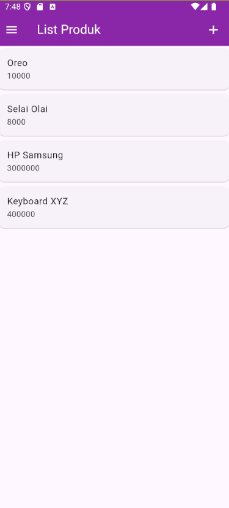

#### 5.3 Pop Up Hapus Produk

    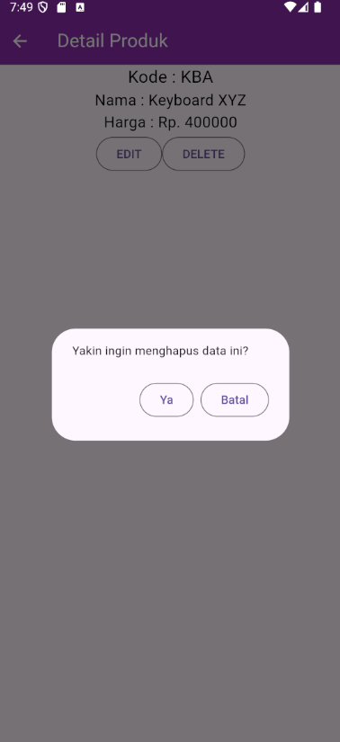
    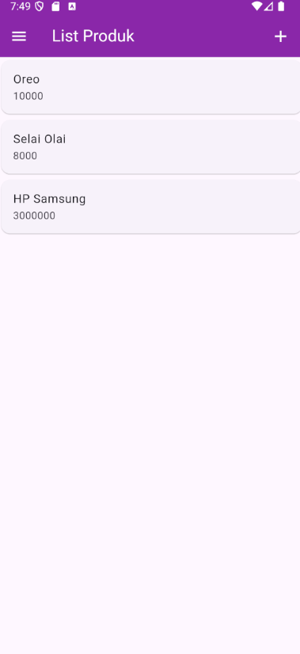

### 6. Sidebar dan Logout

