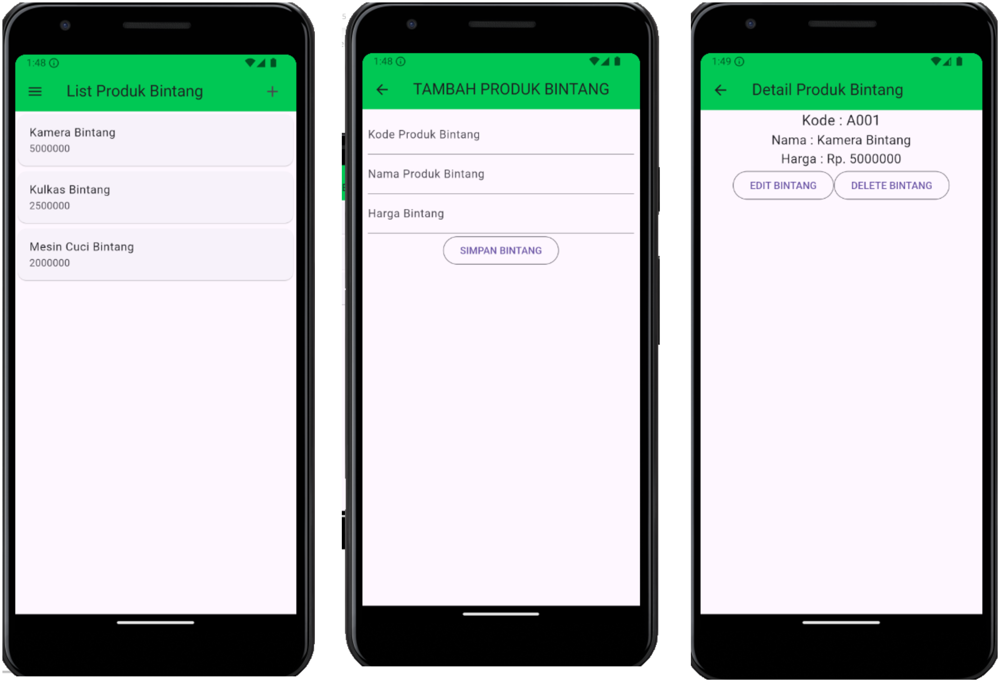

# Tugas Praktikum Pemrograman Mobile 4

1. Nama : Panky Bintang Pradana Yosua
2. NIM : H1D022077
3. Shift Baru : F

## Snapshot Aplikasi

### 1. Registrasi dan Login


### 2. List, Tambah, dan Detail



### 3. Ubah, Hapus, dan Drawer


# Tugas Praktikum Pemrograman Mobile 5

1. Nama : Panky Bintang Pradana Yosua
2. NIM : H1D022077
3. Shift Baru : F

## Penjelasan Kode

### 1. Registrasi

Halaman ini digunakan untuk mendaftarkan user

#### 1.1 Halaman Registrasi `tokokita\lib\ui\registrasi_page.dart`

Halaman registrasi dirender oleh kode di bawah.

```dart
Widget build(BuildContext context) {
  return Scaffold(
    appBar: AppBar(
      title: const Text("Registrasi"),
    ),
    body: SingleChildScrollView(
      child: Padding(
        padding: const EdgeInsets.all(8.0),
        child: Form(
          key: _formKey,
          child: Column(
            mainAxisAlignment: MainAxisAlignment.center,
            children: [
              Text(
                  'Silahkan registrasi terlebih dahulu untuk mendaftarkan diri ke Toko Minuet',
                  style: Theme.of(context).textTheme.bodyMedium),
              _namaTextField(),
              _emailTextField(),
              _passwordTextField(),
              _passwordKonfirmasiTextField(),
              _buttonRegistrasi()
            ],
          ),
        ),
      ),
    ),
  );
}
```


#### 1.2 Registrasi Sukses

Registrasi dilakukan dengan klik tombol Registrasi setelah mengisi data. Proses yang dilakukan ada pada kode di bawah.

Set loading menjadi `true`, lalu data pada registrasi ditangkap, lalu memanggil fungsi `registrasi()` pada `RegistrasiBloc`. Pada proses ini dilakukan request api `POST` ke path /registrasi dengan data yang dikirimkan yaitu `nama`, `email`, dan `password`.

Ada dua kondisi yang dapat terjadi, jika sukses akan memunculkan pesan `Registrasi berhasil, silahkan login` sedangkan jika gagal akan memunculkan pesan `Registrasi gagal, silahkan coba lagi`.

```dart
void _submit() {
  _formKey.currentState!.save();
  setState(() {
    _isLoading = true;
  });
  RegistrasiBloc.registrasi(
          nama: _namaTextboxController.text,
          email: _emailTextboxController.text,
          password: _passwordTextboxController.text)
      .then((value) {
    showDialog(
        context: context,
        barrierDismissible: false,
        builder: (BuildContext context) => SuccessDialog(
              description: "Registrasi berhasil, silahkan login",
              okClick: () {
                Navigator.pop(context);
              },
            ));
  }, onError: (error) {
    showDialog(
        context: context,
        barrierDismissible: false,
        builder: (BuildContext context) => const WarningDialog(
              description: "Registrasi gagal, silahkan coba lagi",
            ));
  });
}
```


### 2. Login

Halaman login digunakan untuk masuk ke aplikasi, sehingga dapat melakukan proses CRUD pada aplikasi Tokokita.

#### 2.1 Halaman Login `tokokita\lib\ui\login_page.dart`

Kode yang dirender adalah sebagai berikut.

```dart
Widget build(BuildContext context) {
  return Scaffold(
    appBar: AppBar(
      title: const Text('Login'),
    ),
    body: SingleChildScrollView(
      child: Padding(
        padding: const EdgeInsets.all(8.0),
        child: Form(
          key: _formKey,
          child: Column(
            children: [
              Text(
                  'Silahkan login terlebih dahulu untuk masuk ke Toko Minuet',
                  style: Theme.of(context).textTheme.bodyMedium),
              _emailTextField(),
              _passwordTextField(),
              _buttonLogin(),
              const SizedBox(
                height: 30,
              ),
              _menuRegistrasi()
            ],
          ),
        ),
      ),
    ),
  );
}
```


#### 2.2 Login Gagal

Proses login dilakukan dengan klik tombol `Login`. Kode yang memproses hal ini adalah sebagai di bawah.

Set loading menjadi `true`, lalu proses login melakukan request api `POST` ke path `/login` dengan mengirimkan email dan password. Jika status berupa `200`, proses login akan menyimpan token dan ID user yang diberikan oleh server hasil dari request API, lalu diarahkan ke halaman list produk. Jika kode selain `200` maka akan dimunculkan pop up pesan `Login gagal, silahkan coba lagi`. Namun, jika terjadi error pada proses login akan memunculkan pesan yang sama juga.

```dart
void _submit() {
  _formKey.currentState!.save();
  setState(() {
    _isLoading = true;
  });
  LoginBloc.login(
          email: _emailTextboxController.text,
          password: _passwordTextboxController.text)
      .then((value) async {
    if (value.code == 200) {
      await UserInfo().setToken(value.token.toString());
      await UserInfo().setUserID(int.parse(value.userID.toString()));
      Navigator.pushReplacement(context,
          MaterialPageRoute(builder: (context) => const ProdukPage()));
    } else {
      showDialog(
          context: context,
          barrierDismissible: false,
          builder: (BuildContext context) => const WarningDialog(
                description: "Login gagal, silahkan coba lagi",
              ));
    }
  }, onError: (error) {
    print(error);
    showDialog(
        context: context,
        barrierDismissible: false,
        builder: (BuildContext context) => const WarningDialog(
              description: "Login gagal, silahkan coba lagi",
            ));
  });
}
```


### 3. List Produk `tokokita\lib\ui\produk_page.dart`

Halaman list produk dirender pada kode di bawah. Mendapatkan list produk dengan request api `GET` ke server pada path `/produk`. Hasilnya akan disimpan pada variable `snapshot.data`

```dart
body: FutureBuilder<List>(
  future: ProdukBloc.getProduks(),
  builder: (context, snapshot) {
    if (snapshot.hasError) print(snapshot.error);
    return snapshot.hasData
        ? ListProduk(
            list: snapshot.data,
          )
        : const Center(
            child: CircularProgressIndicator(),
          );
  },
),
```


### 4. Tambah Produk `tokokita\lib\ui\produk_form.dart`

Halaman ini digunakan untuk menambah produk baru.

#### 4.1 Halaman Tambah Produk

Sebelum merender halaman login, akan dicek terlebih dahulu apakah ada token pada storage. Jika ada akan diarahkan ke halaman list produk. Sedangkan jika tidak ada token maka diarahkan pada halaman login untuk melakukan proses login supaya mendapatkan token, sehingga dapat mengunjungi halaman list produk.

```dart
void isLogin() async {
  var token = await UserInfo().getToken();
  if (token != null) {
    setState(() {
      page = const ProdukPage();
    });
  } else {
    setState(() {
      page = const LoginPage();
    });
  }
}
```

Halaman tambah produk dirender pada kode di bawah.

```dart
Widget build(BuildContext context) {
  return Scaffold(
    appBar: AppBar(title: Text(judul)),
    body: SingleChildScrollView(
      child: Padding(
        padding: const EdgeInsets.all(8.0),
        child: Form(
          key: _formKey,
          child: Column(
            children: [
              _kodeProdukTextField(),
              _namaProdukTextField(),
              _hargaProdukTextField(),
              _buttonSubmit()
            ],
          ),
        ),
      ),
    ),
  );
}
```


#### 4.2 Tambah Produk Sukses

Proses menambahkan produk dilakukan pada kode di bawah,

Pertama, set loading menjadi `true`. Lalu membuat objek produk dengan atribut kode, nama, dan harga. Setelah itu request api `POST` ke path `/produk` dengan data yang dikirimkan dari atribut object product. Jika sukses akan diarahkan ke halaman list produk. Jika gagal akan memunculkan pesan `Simpan gagal, silahkan coba lagi`.

```dart
simpan() {
  setState(() {
    _isLoading = true;
  });
  Produk createProduk = Produk(id: null);
  createProduk.kodeProduk = _kodeProdukTextboxController.text;
  createProduk.namaProduk = _namaProdukTextboxController.text;
  createProduk.hargaProduk = int.parse(_hargaProdukTextboxController.text);
  ProdukBloc.addProduk(produk: createProduk).then((value) {
    Navigator.of(context).push(MaterialPageRoute(
        builder: (BuildContext context) => const ProdukPage()));
  }, onError: (error) {
    showDialog(
        context: context,
        builder: (BuildContext context) => const WarningDialog(
              description: "Simpan gagal, silahkan coba lagi",
            ));
  });
  setState(() {
    _isLoading = false;
  });
}
```


### 5. Detail Produk `tokokita\lib\ui\produk_detail.dart`

Halaman ini untuk menunjukkan detail produk.

#### 5.1 Halaman Detail Produk

Di bawah ini merupaakan kode untuk merender halaman detail produk. Detail produk memperlihatkan kode, nama, dan harga, serta tombol `edit` dan `hapus`.

```dart
Widget build(BuildContext context) {
  return Scaffold(
    appBar: AppBar(
      title: const Text('Detail Produk'),
    ),
    body: Center(
      child: Column(
        children: [
          Text(
            "Kode : ${widget.produk!.kodeProduk}",
            style: const TextStyle(fontSize: 20.0),
          ),
          Text(
            "Nama : ${widget.produk!.namaProduk}",
            style: const TextStyle(fontSize: 18.0),
          ),
          Text(
            "Harga : Rp. ${widget.produk!.hargaProduk.toString()}",
            style: const TextStyle(fontSize: 18.0),
          ),
          _tombolHapusEdit()
        ],
      ),
    ),
  );
}
```


#### 5.2 Halaman Edit Produk `tokokita\lib\ui\produk_form.dart`

Halaman edit produk juga menggunakan produk form, sama seperti saat menambahkan produk. Namun, form pada edit produk memiliki nilai awal. Nilai ini didapatkan dari object produk yang dikirim dari detail produk.`

Kode untuk memproses edit adalah sebagai berikut.

State loading set menjadi `true`. Menyimpaqn object produk dengan id produk yang akan diubah, serta kode, nama, dan harga. Lalu request API `PUT` ke path `/produk/{id}`. Jika berhasil akan diarahkan ke halaman list produk. Jika gagal akan dimunculkan pesan `Permintaan ubah data gagal, silahkan coba lagi`

```dart
ubah() {
  setState(() {
    _isLoading = true;
  });
  Produk updateProduk = Produk(id: widget.produk!.id!);
  updateProduk.kodeProduk = _kodeProdukTextboxController.text;
  updateProduk.namaProduk = _namaProdukTextboxController.text;
  updateProduk.hargaProduk = int.parse(_hargaProdukTextboxController.text);
  ProdukBloc.updateProduk(produk: updateProduk).then((value) {
    Navigator.of(context).push(MaterialPageRoute(
        builder: (BuildContext context) => const ProdukPage()));
  }, onError: (error) {
    showDialog(
        context: context,
        builder: (BuildContext context) => const WarningDialog(
              description: "Permintaan ubah data gagal, silahkan coba lagi",
            ));
  });
  setState(() {
    _isLoading = false;
  });
}
```

<div style="display: flex; justify-content: center;">
    
    
</div>

#### 5.3 Pop Up Hapus Produk `tokokita\lib\ui\produk_detail.dart`

Pop up hapus produk dilakukan ketika meng-klik tombol hapus pada halaman detail produk. Kode yang digunakan sebagai berikut:

```dart
void confirmHapus() {
  AlertDialog alertDialog = AlertDialog(
    content: const Text("Yakin ingin menghapus data ini?"),
    actions: [
//tombol hapus
      OutlinedButton(
        child: const Text("Ya"),
        onPressed: () {
          ProdukBloc.deleteProduk(id: int.parse(widget.produk!.id!)).then(
              (value) => {
                    Navigator.of(context).push(MaterialPageRoute(
                        builder: (context) => const ProdukPage()))
                  }, onError: (error) {
            showDialog(
                context: context,
                builder: (BuildContext context) => const WarningDialog(
                      description: "Hapus gagal, silahkan coba lagi",
                    ));
          });
        },
      ),
//tombol batal
      OutlinedButton(
        child: const Text("Batal"),
        onPressed: () => Navigator.pop(context),
      )
    ],
  );
  showDialog(builder: (context) => alertDialog, context: context);
}
```

Proses ini dilakukan dengan meng-klik tombol `Ya` sebagai konfirmasi. Setelah itu menjalankan fungsi `deleteProduk` yang mana akan request API `DELETE` ke path `/produk/{id}`. Jika berhasil akan diarahkan ke halaman list produk. Jika gagal akan dimunculkan pesan gagal berupa `Hapus gagal, silahkan coba lagi`. Jika meng-klik tombol `Batal` akan membatalkan konfirmasi `Hapus` produk.

<div style="display: flex; justify-content: center;">
    
    
</div>

### 6. Sidebar dan Logout `tokokita\lib\ui\produk_page.dart`

Sidebar digunakan sebagai bar pada sisi kiri yang akan muncul dari kiri apabila hamburger icon diklik. Pada sidebar akan terdapat pilihan logout. Logout digunakan untuk mengakhiri sesi user.

Komponen sidebar dan login dirender pada kode berikut.

```dart
drawer: Drawer(
  child: ListView(
    children: [
      ListTile(
        title: const Text('Logout'),
        trailing: const Icon(Icons.logout),
        onTap: () async {
          await LogoutBloc.logout().then((value) => {
                Navigator.of(context).pushAndRemoveUntil(
                    MaterialPageRoute(builder: (context) => LoginPage()),
                    (route) => false)
              });
        },
      )
    ],
  ),
),
```

Proses logout dilakukan dengan meng-klik tombol `Logout`. Setelah diklik akan menjalankan atribut onTap yang berupa fungsi. Fungsi ini akan menghapus token pada storage, yaitu fungsi `logout()`

```dart
Future logout() async {
  final SharedPreferences pref = await SharedPreferences.getInstance();
  pref.clear();
}
```


